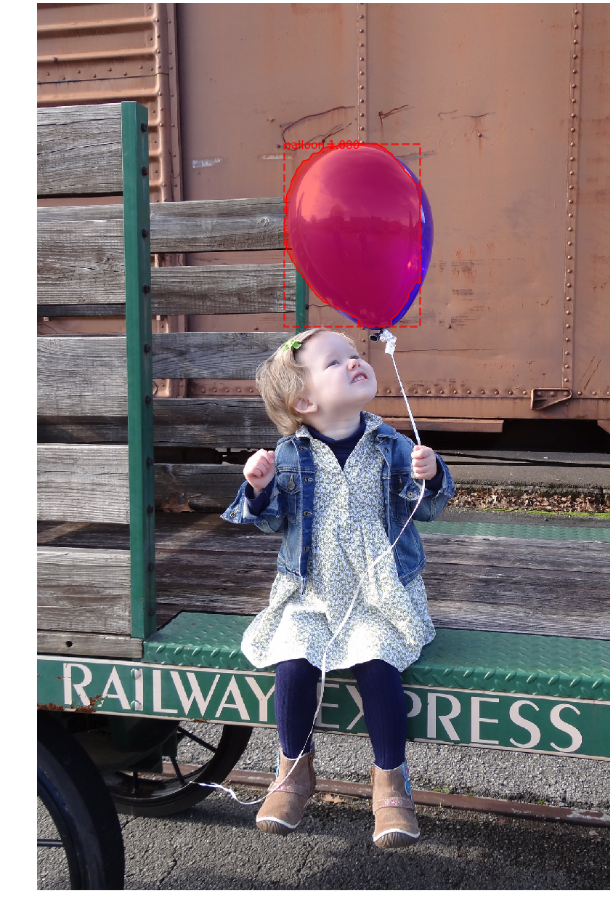

# TensorFlow-MaskRCNN

## Introduction

### Key Features

- in pure tensorflow (include target generation, anchor generation, training, inference and post-process of result).
- use efficient tfrecord.
- ROI Align implement by tensorflow api with support of specific sample ratio.

## Requirements

- python3
- tensorflow >= 1.8.0 
- opencv-python
- scikit-image

## Prepare data
```
python dataset_tools/convert_balloon_to_tfrecord.py --config_name=Config \
--num_shards=7 \
--num_workers=4 \
--split_name=train \
--dataset_dir=your_dataset_dir \
--tfrecord_dir=your_tfrecord_dir \
```

## Train

```
python train.py --checkpoint_dir=./_checkpoints --num_epochs=50 --gpus=0 \
--dataset_info=your_dataset_info_file \ 
--file_pattern=.../tfrecord/train*
```

## Inference

```
python inference.py --checkpoint=your_checkpoint --gpus=0 --image_path=your_image_path
```

## Result



## Credits

- [matterport/Mask_RCNN](https://github.com/matterport/Mask_RCNN)